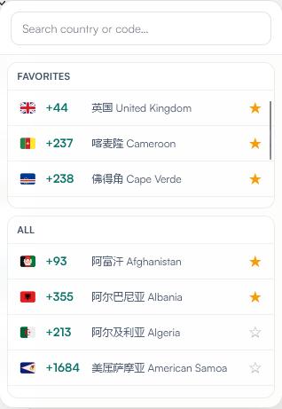
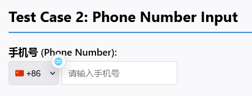

<h1 align="center">Find-Your-Country-Code</h1>

[**English**](./README_EN.md) | **简体中文**

  
**一个浏览器js脚本，专注于在任意网页中快速选择填写手机号的国家区号，可用于篡改猴。**

## 功能特性

- 多信号加权评分自动识别国家/区号字段（`select`、`input`、`intl-tel-input` 场景），按置信度分级行动，称呼前缀、固话本地区号、纯数字枚举等易混淆字段不再误报
- 高置信字段自动注入 🌐 图标；中置信低调注入（半透明小图标，悬停恢复）；低置信默认不注入，可从面板手动召唤
- 支持 `autocomplete` 标准信号（如 `tel-country-code`）与下拉选项内容验证
- 点击 🌐 图标快速打开国家区号面板，支持中文/英文国家名、ISO、区号搜索
- 支持收藏常用国家区号并持久化保存
- 兼容动态页面：MutationObserver 自动扫描 + SPA 路由切换重扫，穿透 open Shadow DOM
- intl-tel-input v16–v29 版本适配；React/Vue 等受控组件经原生事件序列真实同步

## 截图预览

<table>
  <tr>
    <td style="vertical-align: top;">
      
    </td>
    <td style="vertical-align: top;">
      
    </td>
  </tr>
</table>

## 如何使用
### 前置要求

安装以下任意一个浏览器扩展:
- [Tampermonkey](https://www.tampermonkey.net/)
- [Greasemonkey](https://www.greasespot.net/)

### 安装脚本

**方法一：点击直接安装**

- [GreasyFork](https://update.greasyfork.org/scripts/573755/Find-Your-Country-Code.user.js)  |  [Jsdelivr CDN](https://cdn.jsdelivr.net/gh/Xxx91n/Find-Your-Country-Code@refs/heads/main/src/Find-Your-Country-Code.js)

**方法二：手动安装**

1. 复制 [Find-Your-Country-Code.js](./src/Find-Your-Country-Code.js) 的内容。
2. 打开 Tampermonkey 管理面板。
3. 点击 添加新脚本。
4. 粘贴代码并保存。

## 贡献

提交 [issue](https://github.com/Xxx91n/Find-Your-Country-Code/issues) 或 [PR](https://github.com/Xxx91n/Find-Your-Country-Code/pulls)。

## 许可证

[MIT License](./LICENSE)
